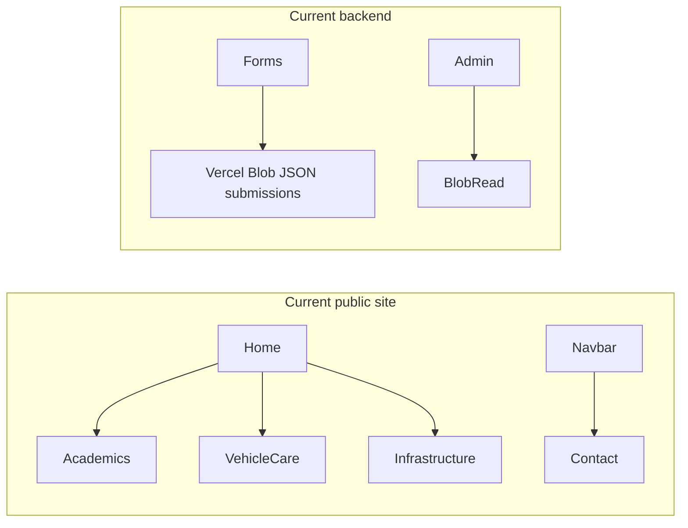
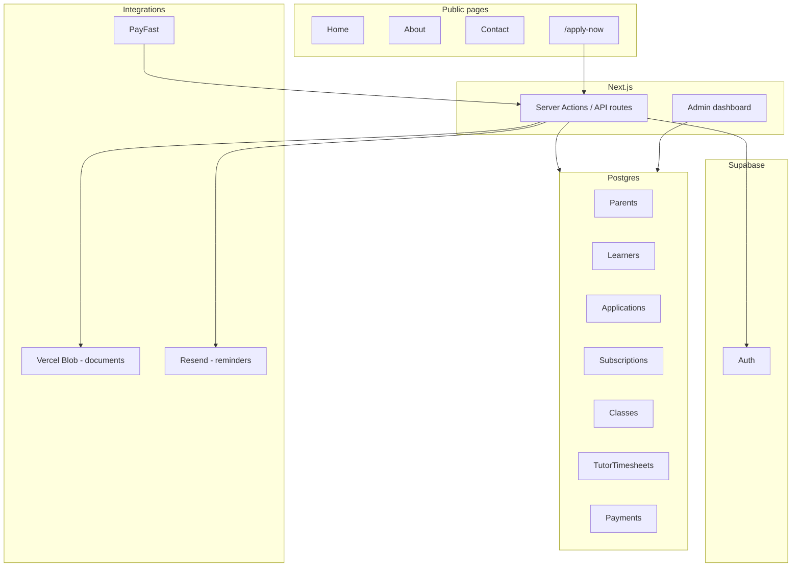

# Ilithiyana Academics — full platform plan

## Source of truth

Meeting materials in [docs/context/](docs/context/):

| Doc                                                                                | Use                                                                                                      |
| ---------------------------------------------------------------------------------- | -------------------------------------------------------------------------------------------------------- |
| [meeting summary.md](docs/context/meeting%20summary.md)                            | Priorities: academics-only site, online applications, DB, filtering, scheduling, payments, tutor payroll |
| [meeting summary actions.md](docs/context/meeting%20summary%20actions.md)          | Pain points, packages A/B, PayFast vs Yoco, email reminders                                              |
| [meeting_summary_citations.md](docs/context/meeting_summary_citations.md)          | Form fields, 1:3 class ratio, roles (parent/learner/tutor/admin), onboarding                             |
| [packages.jpeg](docs/context/packages.jpeg), [flyer.jpeg](docs/context/flyer.jpeg) | Visual copy for packages/subjects (reference during copy agents)                                         |

**Your decisions (locked):**

- **Navigation:** Home, About, Contact, **Apply Now** — no separate Academics nav item; marketing content (subjects, packages, session info) moves to **Home + About**; **`/academics` → `/apply-now`** (301).
- **Scope:** Full platform in one program (not website-only): Supabase + applications + admin CRM + PayFast + email reminders + tutor timesheet approval.

---

## Current state (codebase)

Next.js 14 App Router site with multi-service positioning:



**Remove / redirect:**

- Routes: [`app/vehicle-care/page.tsx`](app/vehicle-care/page.tsx), [`app/infrastructure/page.tsx`](app/infrastructure/page.tsx)
- Components: [`VehicleCareForm.tsx`](app/components/VehicleCareForm.tsx), [`InfrastructureForm.tsx`](app/components/InfrastructureForm.tsx)
- Admin: [`submissions/vehicle-care`](app/admin/dashboard/submissions/vehicle-care/page.tsx), [`submissions/infrastructure`](app/admin/dashboard/submissions/infrastructure/page.tsx)
- Nav/footer links in [`navbar.tsx`](app/components/navbar.tsx), [`Footer.tsx`](app/components/Footer.tsx)
- Multi-service copy in [`hero-section.tsx`](app/components/hero-section.tsx), [`page.tsx`](app/page.tsx), [`about/page.tsx`](app/about/page.tsx), [`stats-section.tsx`](app/components/stats-section.tsx), [`trust-signals-section.tsx`](app/components/trust-signals-section.tsx), [`layout.tsx`](app/layout.tsx) metadata

**Preserve and evolve:**

- [`AcademicsForm.tsx`](app/components/AcademicsForm.tsx) → becomes Apply Now form (currently grades 8–12 only, no file uploads, saves to Blob via [`form-actions.ts`](app/actions/form-actions.ts))
- Package/subject content from [`app/academics/page.tsx`](app/academics/page.tsx) → distributed to Home/About before route removal
- Real contact details already in footer: `info@ilithiyana.co.za`, `065 031 0714` (fix placeholder data on [`contact/page.tsx`](app/contact/page.tsx))

**Canonical academics offering (site-wide):**

- **Subjects:** Pure Maths, Natural Sciences, Life Sciences, English, Physical Science
- **Grades:** 6–12 (extend form + copy; today form stops at grade 8)
- **Packages (from existing academics page + meeting):**
  - Package A: R1,000/month — 8 lesson hours + 4h career guidance
  - Package B: R175/lesson — exam-prep style, 4h career guidance
- **Ratio / positioning:** ~1 tutor : 3 learners; applications always open; small-group online tutoring

---

## Target architecture



**Auth roles (phased inside platform work):**

| Role                | Wave | Capability                                                    |
| ------------------- | ---- | ------------------------------------------------------------- |
| Admin (Sunday/team) | 1    | Review applications, filter, export, approve timesheets       |
| Parent              | 2    | View learner status, subscription, schedule (read-only first) |
| Tutor               | 2    | Submit monthly session log                                    |
| Learner             | 3    | View schedule / join links (future)                           |

---

## Documentation deliverables (before Wave 1)

Per repo rules, create before implementation:

1. [`docs/plans/2026-05-24-ilithiyana-academics-platform.md`](docs/plans/2026-05-24-ilithiyana-academics-platform.md) — this plan persisted
2. [`docs/prompts/2026-05-24-ilithiyana-academics-platform-prompt.md`](docs/prompts/2026-05-24-ilithiyana-academics-platform-prompt.md) — agent execution brief
3. [`docs/prompts/README.md`](docs/prompts/README.md) — index row

**Shared code contract (orchestrator, sequential — blocks parallel agents):**

Create [`lib/site-config.ts`](lib/site-config.ts) (single source for subjects, grades, packages, contact, brand strings) so 8 agents do not drift on copy.

---

## Supabase data model (Wave 1 foundation)

Core tables (minimum viable for full-platform start):

- `parents` — guardian name, email, phone, address, province/region
- `learners` — name, DOB, school, grade, level (where applicable), linked parent
- `applications` — status (`pending` | `approved` | `rejected`), subjects[], package, schedule JSON, report_url, payment_proof_url, created_at
- `tutors` — name, email, subjects[], session_rate
- `subscriptions` — learner_id, package, status (`paid` | `pending` | `overdue`), period_start/end, amount
- `classes` — subject, grade, level, tutor_id, schedule, meet_link (optional text for now)
- `tutor_timesheets` — tutor_id, month_period, sessions_count, amount, status (`submitted` | `approved` | `rejected`)
- `payments` — subscription_id, gateway_ref, amount, status, paid_at

**RLS:** public cannot read PII; application insert via service role or hardened RPC; admin role full read; parent/tutor scoped read in Wave 2.

Use Supabase MCP + CLI migrations under `supabase/migrations/` (new folder).

---

## Page specifications

### Home [`app/page.tsx`](app/page.tsx)

- Hero: Ilithiyana **Academics** — online tutoring Grades 6–12
- Primary CTA → `/apply-now`; secondary → `/about`
- Sections: subjects grid, packages summary (from former `/academics`), how it works (apply → onboarding → classes), stats **academics-only** (remove fleet/infrastructure metrics)
- Replace generic trust badges with education-relevant signals (small classes, subject specialists, continuous intake)

### About [`app/about/page.tsx`](app/about/page.tsx)

- Ilithiyana Academics / Masande Dudula story — **no** vehicle care, infrastructure, or “multi-sector” language
- Mission: learner success, accessible online tutoring
- Founder card retained; commitment cards reframed for education

### Contact [`app/contact/page.tsx`](app/contact/page.tsx)

- Align with footer: `info@ilithiyana.co.za`, `065 031 0714`
- General enquiry form → `contact` submissions table (or retain Blob short-term, migrate in Wave 1 agent 6)
- Optional: WhatsApp link if client confirms number

### Apply Now — new [`app/apply-now/page.tsx`](app/apply-now/page.tsx)

- Full application (evolve `AcademicsForm`):
  - Parent + learner fields (existing)
  - **Grade 6–12** select
  - **Province / region** (for filtering per meeting)
  - Subjects (canonical list)
  - Package A/B
  - Availability (existing day/time UI)
  - **Uploads:** latest school report + proof of payment → Vercel Blob URLs stored on application row
- Mobile-first layout; success state with next steps (onboarding call, payment follow-up)
- Server action: validate → Supabase insert → optional admin notification email

### Redirects [`next.config.mjs`](next.config.mjs)

```js
redirects: [
  { source: "/academics", destination: "/apply-now", permanent: true },
  { source: "/vehicle-care", destination: "/", permanent: true },
  { source: "/infrastructure", destination: "/", permanent: true },
];
```

---

## Integrations (Waves 2–3 within same program)

### PayFast

- Package selection on application → create subscription record `pending`
- PayFast ITN/webhook route → mark `paid`, store `payments` row
- Admin view of payment status per learner

### Email reminders (Resend MCP)

- Cron or scheduled job: subscriptions due in N days → templated email
- Manual WhatsApp remains out of scope for automation (per meeting cost note)

### Admin dashboard

Upgrade [`app/admin/dashboard`](app/admin/dashboard):

- Remove vehicle/infrastructure submission views
- **Applications:** filter by province, grade, subject, package, status; export CSV
- **Subscriptions:** paid/pending/overdue
- **Timesheets:** tutor submit (Wave 2 UI) + admin approve/reject

### Scheduling (pragmatic v1)

- Store class schedule per learner in DB; display in admin + parent portal
- Google Meet links: manual field on `classes` for now (automate Meet API later per meeting pain point)

---

## Parallel execution model (max 8 sub-agents)

**Rule:** Orchestrator completes **Phase 0** alone, then launches **one wave at a time** (≤8 agents). Agents touch **disjoint file sets**; shared types only via `lib/site-config.ts` + generated Supabase types.

### Phase 0 — Orchestrator (sequential, ~30 min)

- Write plan + prompt docs above
- Add `lib/site-config.ts`
- Scaffold `supabase/` + env template (`.env.example`: `NEXT_PUBLIC_SUPABASE_URL`, `SUPABASE_SERVICE_ROLE_KEY`, PayFast, Resend)
- Create empty migration stub for agents to extend

### Wave 1 — Foundation (8 agents, parallel)

| ID  | Agent           | Owns                                                                          | Deliverable                                                 |
| --- | --------------- | ----------------------------------------------------------------------------- | ----------------------------------------------------------- |
| A1  | `db-schema`     | `supabase/migrations/*`, `lib/supabase/*`, types                              | Schema + RLS + seed admin                                   |
| A2  | `decommission`  | Delete legacy pages/components; `next.config` redirects                       | No vehicle/infrastructure surface                           |
| A3  | `site-shell`    | `navbar`, `Footer`, `layout` metadata, `cta`, `globals` if needed             | Academics-only chrome; nav: Home, About, Apply Now, Contact |
| A4  | `home-page`     | `page.tsx`, `hero-section`, `stats-section`, `trust-signals`, `about-section` | Academics-focused home                                      |
| A5  | `about-page`    | `app/about/page.tsx`                                                          | Academics-only about                                        |
| A6  | `contact-apply` | `contact/page.tsx`, `apply-now/page.tsx`, `AcademicsForm`, `form-actions`     | Apply flow → Supabase + uploads                             |
| A7  | `admin-crm`     | Admin sidebar, dashboard, applications list/filter                            | Admin can review applications                               |
| A8  | `seo-sitemap`   | `scripts/generate-sitemap.mjs`, `public/manifest.json` if present             | Sitemap priorities for new IA                               |

**Wave 1 exit gate:** `npm run build` passes; `/apply-now` submits to Supabase; legacy URLs redirect; no infra/fleet copy in grep.

### Wave 2 — Payments and subscriptions (≤8 agents)

| ID  | Agent                                                  | Deliverable |
| --- | ------------------------------------------------------ | ----------- |
| B1  | PayFast checkout + webhook                             |             |
| B2  | Subscription lifecycle + admin UI                      |             |
| B3  | Resend reminder templates + cron/route                 |             |
| B4  | Application approval workflow (approve/reject → email) |             |
| B5  | Parent auth + portal (read-only status)                |             |
| B6  | Tutor auth + timesheet submit form                     |             |
| B7  | Admin timesheet approve/reject                         |             |
| B8  | Class schedule admin + parent view                     |             |

### Wave 3 — Hardening (orchestrator or 2–3 agents)

- POPIA-minded privacy copy on Apply Now
- E2E smoke: apply → admin see → PayFast sandbox → reminder
- Remove Blob-only submission path for academics
- Deploy to `staging` branch; client review

---

## Agent brief template (each sub-agent receives)

```markdown
## Goal

[one sentence]

## Read first

- docs/prompts/2026-05-24-ilithiyana-academics-platform-prompt.md
- lib/site-config.ts

## Files you MAY edit

[explicit list]

## Do NOT touch

[other agents' files]

## Acceptance

- [ ] ...
- [ ] npm run build
```

---

## Risk and dependency notes

- **Layout.tsx duplicate import** at bottom of [`app/layout.tsx`](app/layout.tsx) (lines 89+) should be fixed in A3 to avoid build issues.
- **AcademicsForm** uses loose `any` and missing upload fields — A6 owns full rewrite with Zod validation.
- **PayFast + Supabase** need production credentials from client; sandbox first on staging.
- **Full platform in one program** is large; Waves are mandatory gates—do not launch Wave 2 until Wave 1 exit gate passes.
- **about-developer** page: keep linked in footer only if desired; out of critical path.

---

## Acceptance criteria (program complete)

1. Site presents **only** Ilithiyana Academics (Grades 6–12, five subjects, Packages A/B).
2. Public pages: **Home, About, Contact, Apply Now**; `/academics`, `/vehicle-care`, `/infrastructure` redirect correctly.
3. Parents apply online with document uploads; data in **Supabase**, not manual PDF re-entry.
4. Admin filters applications by province, grade, subject, package, status; can export.
5. **PayFast** records subscription payments; admin sees paid/pending/overdue.
6. **Email reminders** fire for due subscriptions (Resend).
7. Tutors submit timesheets; admin approves; amounts derive from session rate × count.
8. `staging` branch deployable; `npm run build` clean.
